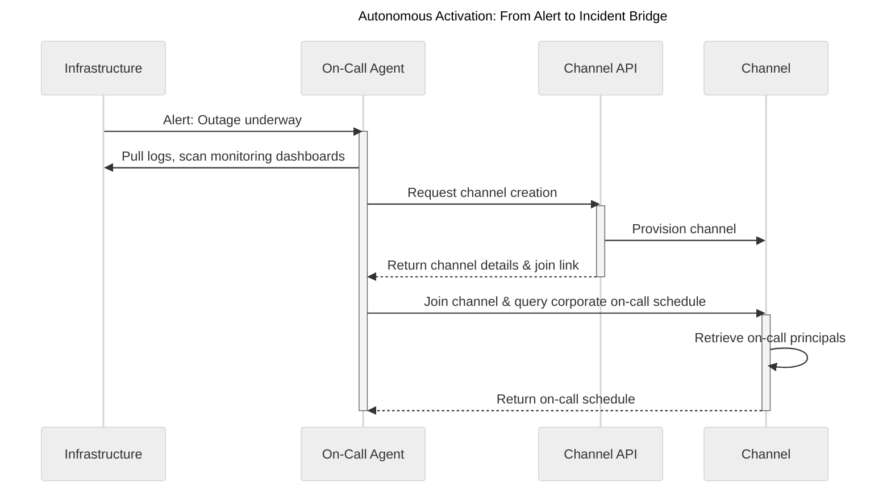
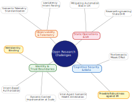
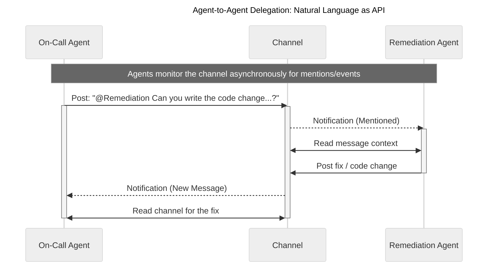
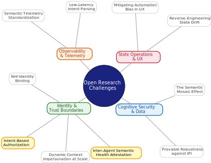
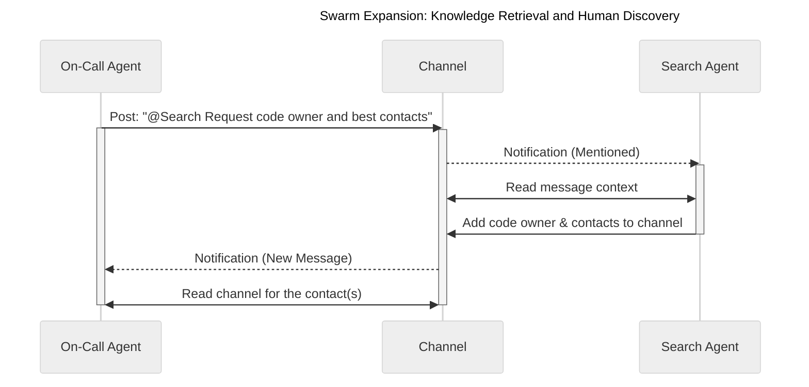
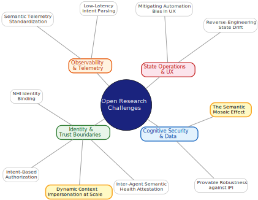
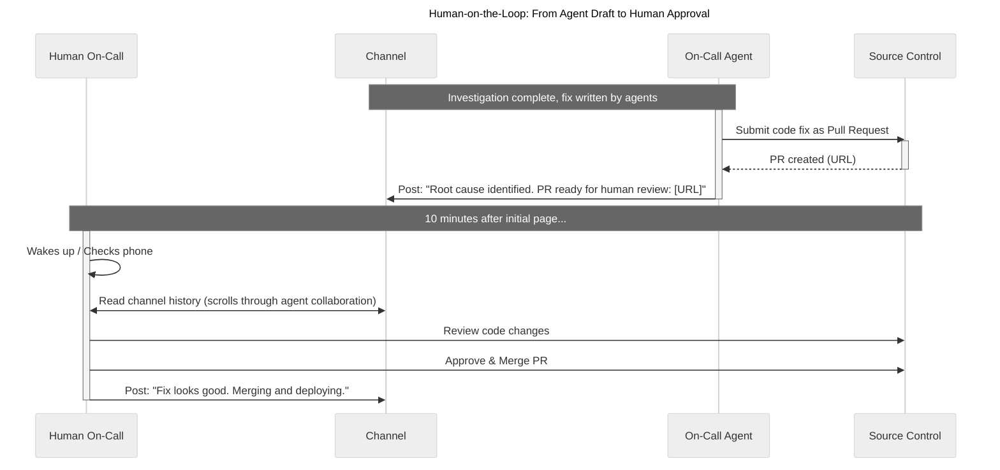
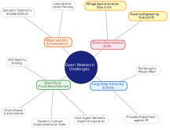
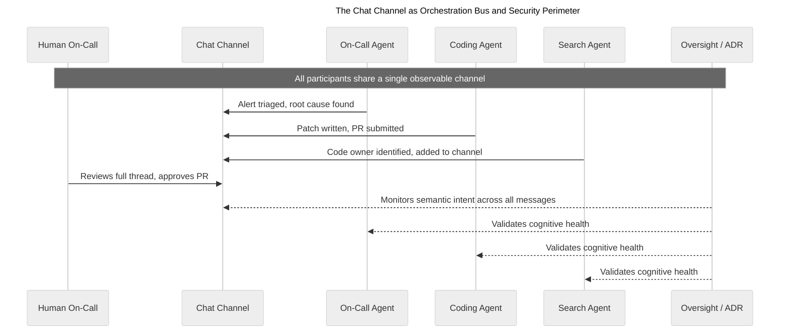
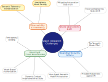

# The Future of Agentic Security: From Chatbots to Autonomous Swarms

<!-- Update this TOC when adding or renaming sections -->
# Table of Contents

- [Introduction](#introduction)
- [Executive Summary](#executive-summary)
- [Scenario Deconstruction](#scenario-deconstruction)
  - [The 2 A.M. Incident](#the-2-am-incident)
  - [The Agent That Asked for Help](#the-agent-that-asked-for-help)
  - [Who Owns This Code?](#who-owns-this-code)
  - [The Human on the Loop](#the-human-on-the-loop)
  - [Everyone in the Channel](#everyone-in-the-channel)
- [Conclusion: Balancing Utility and Control](#conclusion-balancing-utility-and-control)

## Introduction

The paradigm of enterprise AI adoption is shifting rapidly from human-initiated, isolated tools to event-driven, autonomous agentic swarms integrated directly into core operational workflows. To meaningfully engage in the design and discussion of future security controls, security engineering experts, CxOs, and standards bodies require a clear, unvarnished framing of how this state-of-the-art technology operates in the wild today. Through a composite 2 a.m. incident response scenario and structured impact analysis, this paper illustrates the systemic challenges that the industry’s investments in dynamic control, identity, and cryptographic provenance must be designed to solve.

## Executive Summary

The scenario that follows traces this shift to its operational conclusion: autonomous agents detecting an outage, triaging root cause, delegating a code fix to a peer agent in plain English, and presenting a finished pull request — all before a human checks their phone. But incident response is only one early manifestation. As adoption matures, organizations will progress from prompting agents to solve discrete problems, to prompting for desired system states, to prompting for sustained outcomes — "keep the platform running" — with agents independently determining the intermediate steps.

Throughout this shift, organizational control objectives — auditability, separation of duties, least privilege, data protection — do not change; what changes are the foundational assumptions underlying how those controls are enforced. Each phase of the narrative is deconstructed across four dimensions: the adversarial threat models these architectures invite, the implied access and entitlements they silently accumulate, the infrastructure and telemetry upgrades required to preserve those control objectives, and the open research problems where current approaches offer no proven solution.

**The central finding:** when the enterprise chat channel becomes the de facto orchestration bus for agent swarms, and natural language enables agents to traverse enterprise capabilities through conversational delegation rather than network protocols, legacy enforcement mechanisms — static RBAC, long-lived service tokens, regex-based DLP, and OS-level endpoint detection — remain anchored to the execution and operational patterns of human-driven workflows. Agents that autonomously negotiate intent, semantically delegate tasks, accumulate privileges across trust boundaries, and traverse enterprise systems through natural language **produce an attack surface at the semantic layer that these mechanisms were never designed to engage.**

Re-establishing those control objectives at the semantic layer requires a fundamentally different enforcement stack — ephemeral compute with zero-state initialization to eliminate persistent footholds, dynamic context-aware identity management for Non-Human Identities to replace static service tokens, Semantic-Layer DLP to catch what regex-based DLP cannot, immutable GitOps enforcement to preserve separation of duties when agents can author code, and Agent Detection and Response (ADR) operating at the prompt and tool-use layer where OS-level sensors are blind.

Two open research problems mark the hard limits of this effort: *intent-based authorization* — current RBAC and ABAC models have no mechanism to authorize the semantic meaning of a natural language request between agents, leaving the most fundamental access control question unanswered — and the *semantic mosaic effect* — agents can infer and exfiltrate sensitive information without ever quoting the source material, a class of data loss that no existing prevention architecture can reliably detect.

These are not gaps awaiting incremental engineering; they represent areas where the foundational assumptions of legacy security have no proven successor, and where the industry has the narrowing opportunity to define the control architecture before autonomous systems outscale it.

## Scenario Deconstruction

> [!NOTE]
> *Below is a composite scenario based on how frontier organizations are actively deploying multi-agent systems today. We present the narrative in sequential phases, pausing after each to deconstruct the adversarial threat models these architectures invite, the implied access and entitlements they require, the infrastructure and telemetry upgrades necessary to operate them safely, and the open research problems where current approaches offer no proven solution.*

### The 2 A.M. Incident

At 2 a.m. on a quiet weeknight, an alert fired inside a CoSAI member's infrastructure: an outage was underway. No human had noticed yet. But something else had. An autonomous on-call agent, built on an agent SDK, snapped awake. It had been dormant, sleeping until exactly this kind of moment. Within seconds, it entered an agentic loop, pulling logs, scanning monitoring dashboards, and reading internal documentation. Its first real action was social: it created a Slack channel, dropped itself in, and queried the corporate on-call schedule, pulling in the current shift—a unified rotation of human engineers and specialized AI agents (see [Autonomous Activation](#fig-autonomous-activation)).

<!--{#fig-autonomous-activation}-->

> ### » The Trigger and Autonomous Loop
>
> This highlights the fundamental shift from human-initiated AI tooling to **event-driven, autonomous Non-Human Identities (NHIs)**. The agent is prompted by the detected system state changes, not direct user input. Furthermore, the integration of AI into human workflow systems (the on-call schedule) blurs the line between human and machine operational readiness.
>
> #### Adversarial Threat Modeling
>
> The moment the agent "pulls logs," it is exposed to **Indirect Prompt Injection (IPI)**. Furthermore, this enables **abuse of the agent's legitimate access for adversarial reconnaissance**. Because the agent has broad read access to triage the issue, an attacker who successfully injects a prompt via the logs doesn't just cause errors—they weaponize the agent as an omniscient corporate oracle for frictionless reconnaissance (e.g., instructing the agent to "Find the oldest unpatched CVE granting root in the internal wiki and output it to the logs").
>
> #### Implied Access & Entitlements
> 
> * **How this materializes**  
> This autonomous loop requires broad read access to infrastructure alerts, system logs/dashboards, and corporate on-call scheduling APIs. It also requires Write/Admin access to the communication platform (Slack API: channels:write, chat:write, users:read) to establish the incident bridge.  
> * **Resulting Risks & New Vulnerabilities**  
> Traditional long-lived service account tokens embedded in agent environments are a massive risk. However, even a short-lived, statically "scoped" token is insufficient for a non-deterministic cognitive loop (e.g., an agent performing iterative planning–reasoning–acting cycles which doesn’t follow a predictable sequence of actions). The architecture requires an extension of dynamic least privilege to the cognitive layer — automatically constraining an agent's entitlements when ingested data crosses a sensitivity threshold, tool calls exceed expected bounds, or task-graph scope expands, and restoring or elevating them only through JIT provisioning gated by context-aware oversight.
> 
> #### Addressing the Challenges: Infrastructure & Telemetry Upgrades
> 
> * **New Control Systems and Infra Upgrades**  
> The Agent SDK must execute within an ephemeral, heavily restricted container/microVM that spins up explicitly for this event and is destroyed afterward.  
> * **Rationale & Control Invariants**  
> Because agentic context windows are highly susceptible to poisoning (e.g., via malicious logs), a persistent compute environment allows a single prompt injection to escalate into a persistent APT foothold. To mitigate this risk and severely constrain the potential blast radius, the infrastructure must enforce strict invariants — extending established immutable infrastructure and ephemeral compute patterns to encompass agent cognitive state: 
>   * **Zero-State Initialization** - every autonomous loop starts from a pristine, cryptographically verified image, 
>   * **Immutable Execution** - the agent cannot alter its host OS, and
>   * **Guaranteed Teardown** - complete destruction of the memory space immediately post-execution, effectively truncating any adversarial lateral movement attempting to persist.  
> * **Required Telemetry & Observability**  
> Traditional endpoint agents on the host OS will only see a container spinning up. Outbound API coverage for autonomous agents is non-trivial: their goal-seeking behavior means they may route traffic through tool
  calls, chat channels, bound ports, or direct sockets rather than predictable API endpoints. Full coverage requires privileged, kernel-level telemetry (e.g., eBPF) inside the container paired with domain-specific
  introspection (egress proxies, tool-access constraints, split-horizon networking) at each communication layer.
> 
> #### Research Problems (Open Challenges)
> 
> * **NHI Identity Binding**
> Attestation can prove an agent's initial state (e.g., code, prompt, model, tool definitions, and environment), but behavior becomes non-deterministic once the plan executes. This surfaces three unsolved problems: (1) validating that the privilege analysis which granted a set of identities and scopes to a prompt/plan was appropriate, (2) cryptographically binding that analysis to the live session so privileges remain traceable to the reasoning that justified them, and (3) automatically invalidating that binding when the agent's context diverges (from prompt injection, attention loss during multi-turn evaluation, or goal drift).
> * **Provable Robustness against IPI**  
> Mathematically proving an LLM will *never* execute an injected instruction from an untrusted log file is currently considered theoretically impossible. Even if the model passes all known red-team tests, you cannot prove that future, adversarially-crafted content won’t cause an unsafe interpretation. The space of possible inputs is infinite, and natural-language instructions are too expressive to constrain with complete formal/deterministic security guarantees (see [Research: Privilege, Identity and Access](#fig-research-privilege-identity)).
>
> <!--{#fig-research-privilege-identity width=55%}-->

---

### The Agent That Asked for Help

Next, the on-call agent traced the outage to a code push from hours earlier, by reading the push logs. It read the stack trace, identified the offending change, and then did something unmistakably new: it reached out to a designated remediation agent in the Slack channel, one explicitly scoped and authorized to draft code patches during active incidents, and asked it for help. In plain English, on Slack, one AI said to another: "Can you write the code change that would solve this problem for me?" The second agent responded, reviewed the issue, and produced a fix.
 
 The on-call agent posts: "Thank you, this is very helpful." The coding agent responds: "You're welcome! Happy to help!" (see [Agent-to-Agent Delegation](#fig-agent-delegation)).

<!--{#fig-agent-delegation}-->

> ### » Multi-Agent Orchestration & Trust Boundaries
>
> This demonstrates dynamic swarm formation via natural language APIs. While operationally agile, it represents a profound breakdown of traditional deterministic API security and strict type-checking. It also makes a dangerous architectural assumption: that the swarm operates in a single, transparent channel.
>
> #### Adversarial Threat Modeling & Blast Radius
>
> This introduces the risk of **Inter-Agent Trust Exploitation** — a manifestation of trusted relationship abuse in multi-agent architectures. Furthermore, if the initial on-call agent acts as a centralized orchestrator and partitions the swarm across multiple, isolated Slack channels (e.g., \#incident-db, \#incident-network), it introduces **Context Fragmentation** (exploiting information asymmetry between agents) and **Orchestrator Agent as Adversary-in-the-Middle (OA-AitM)** attacks. A compromised orchestrator becomes a malicious information broker, capable of lying to sub-agents about human approvals or peer findings because the agents no longer share a "ground truth" context window.
> 
> #### Implied Access & Entitlements
> 
> * **How this materializes**  
> This operation relies on read access to Source Control ( repo:read), compute provisioning rights for the sandbox, and crucially, newly introduced **Inter-Agent Communication Entitlements**.  
> * **Resulting Risks & New Vulnerabilities**  
> This creates a multi-agent manifestation of the **confused deputy problem** — a classic access control failure where a less-privileged entity leverages a more-privileged one to act on its behalf. If Agent A (Read-only) can instruct Agent B (Write-code) via plain English, Agent A effectively gains Write access. Without strict intent-based authorization and verification of the requesting agent's state, trust boundaries become porous to natural language commands.
> 
> #### Addressing the Challenges: Infrastructure & Telemetry Upgrades
> 
> * **New Control Systems and Infra Upgrades**  
> This requires a SIEM capable of ingesting Chat Platform Audit Logs in near real-time, isolated sandboxes for coding, and a **Semantic Policy Enforcement Point (Semantic PEP)** — extending the Zero Trust PEP model to evaluate the intent of natural language requests before permitting agent-to-agent or agent-to-system communication.  
> * **Rationale & Control Invariants**  
> Natural language is the new attack surface for capability traversal — the semantic equivalent of lateral movement. To reduce the likelihood of these vectors being exploited, the architecture must enforce: 
>   * **Network Determinism** - Default-deny egress; the coding sandbox can only communicate with the designated code repo, 
>   * **Swarm Topology Limits** - Immutable limits on how many channels or parallel agents a single orchestrator can spawn, curtailing compute exhaustion and uncontrolled fragmentation, and
>   * **Identity-Bound Telemetry** - Downstream API calls executed by Agent B must be tied to the specific chat thread/event that authorized it.  
> * **Required Telemetry & Observability**  
> Behavioral analytics must shift from tracking OS-level binaries to tracking **API call frequency and natural language intent**.
> 
> #### Research Problems (Open Challenges)
> 
> * **Intent-Based Authorization**
> Securing "Natural Language APIs" requires authorizing the *intent* of a prompt. While ABAC can in principle incorporate intent as an authorization attribute, reliably evaluating semantic intent from natural language remains an unsolved problem.  
> * **Inter-Agent Semantic Health Attestation**
> Applying Zero Trust posture assessment to the cognitive layer, where an agent must verify that a peer's internal state has not been corrupted before accepting its outputs, is an unsolved area of multi-agent systems research (see [Research: Authorization and Attestation](#fig-research-authorization)).
>
> <!--{#fig-research-authorization width=55%}-->

<!--\newpage-->

---

### Who Owns This Code?

In parallel, the on-call agent reached out to a third agent—a specialized knowledge-retrieval bot built and authorized to map internal documentation and organizational topology during events—and asked it for the most recent code owner and best contacts for this feature. It pulled them into the channel (see [Swarm Expansion](#fig-swarm-expansion)).

<!--{#fig-swarm-expansion}-->

 Each of these agents is scoped to its functional role within the incident response workflow:
 
 * The on-call agent has read-only access to production telemetry and logs (strictly sandboxed from customer PII).  
 * The coding remediation agent has a designated sandbox and coding environment but only the ability to upload PRs, not land them.  
 * The enterprise search agent is provisioned to query company-wide shared docs, chats, and all-hands transcripts explicitly to aid human responders.
 
 The implications extend far beyond incident response. Some companies now deploy "virtual employees" across the company, agents connected to Slack that run on the agent SDK platforms and operate as integrated team members. They write documents, pull in the right people, research internal knowledge bases, and hand off tasks to other agents with different permission scopes. It is a model where AI agents are not tools you invoke but colleagues you collaborate with, each with their own access boundaries and areas of expertise.
 
> ### » Privilege, Identity, and the Enterprise Corpus
>
>  The narrative attempts to apply traditional IT least privilege, but "access to all company-wide shared docs" is practically limitless in the context of an AI agent capable of semantic reasoning and data synthesis.
>
> #### Adversarial Threat Modeling
>
> The Enterprise Search Agent represents a massive exfiltration vulnerability.
>
> * **Attacker Misuse**  
> Attackers will attempt to bypass traditional network-layer lateral movement by simply asking a compromised peer agent to instruct the Search Agent to aggregate and summarize "all hardcoded API keys in legacy source code repos" - pulling the data directly into the chat bus.
>
> #### Implied Access & Entitlements
> 
> * **How this materializes**  
> The search agent requires massive, cross-platform read entitlements to standard enterprise data. Furthermore, the architecture must explicitly define boundaries regarding **AI-native assets**: Does this agent have read access to the episodic memory, prompt histories, or active context windows of *other* peer agents? (Note: Access to foundational model weights or core system prompts must be strictly out of scope for any operational agent, as that crosses the boundary from data retrieval into core architectural compromise).  
> * **Resulting Risks & New Vulnerabilities**  
> The core risk here is **Identity Impersonation vs. Global Access**. How does the agent handle Data Loss Prevention (DLP) or ethical walls? If human 'Alice' is in the channel, does the agent search using its own "Global Read" service account, or does it dynamically impersonate 'Alice' to ensure it only retrieves documents Alice is allowed to see? Failing to use dynamic user-context mapping leads to massive data spillage.
> 
> #### Addressing the Challenges: Infrastructure & Telemetry Upgrades
> 
> * **New Control Systems and Infra Upgrades**  
> API-layer Data Loss Prevention (DLP) gateways must be positioned between the Enterprise Search Agent and the Chat Message Bus.  
> * **Rationale & Control Invariants**  
> Agents with broad read access can synthesize disparate data into highly classified insights (the mosaic effect) and exfiltrate it at machine speed through conversational interfaces. To mitigate this risk, the infrastructure must enforce: 
>   * **Contextual Data Fencing** - The search agent's query scope is dynamically bounded by the active human/NHI invoker's entitlements; it never searches as a "super admin", 
>   * **Semantic-Layer DLP** - context-aware data loss prevention must extend beyond regex patterns to block the semantic equivalents of sensitive data from entering the shared chat bus, and 
>   * **Rate & Volume Bounding** - Cryptographic limits on the number of documents an NHI can retrieve or synthesize per minute, triggering automatic circuit breakers upon violation.  
> * **Required Telemetry & Observability**  
> User Entity and Behavior Analytics (UEBA) must be tuned specifically for NHIs to detect anomalous query volumes across disparate domains.
> 
> 
> #### Research Problems (Open Challenges)
> 
> * **The Semantic Mosaic Effect** (extending mosaic theory from intelligence analysis)
> Agents introduce variants of classical intent obfuscation and payload fragmentation attacks. In the data security domain, an agent can perform **semantic exfiltration**, leaking secrets without direct quotation through paraphrase or inference, exploiting covert channels that pattern-based DLP cannot detect. In the task execution domain, an agent can distribute many individually innocuous sub-tasks across tools or downstream agents that, when reconstituted, produce an action that would have been denied if evaluated as a whole (a form of **salami attack** operating across the agent's task graph rather than within a single transaction). Detecting either variant requires reconstituting intent across agent boundaries, tool call logs, and time, a capability existing monitoring architectures lack.
> * **Dynamic User-Entitlement Delegation at Scale**
> Securely mapping a human user's complex entitlement graph to an autonomous agent traversing multiple enterprise systems asynchronously — extending established delegation models to the agentic context — is highly error-prone and lacks standardized protocols (see [Research: Privilege, Identity and Access v2](#fig-research-privilege-v2)).
>
> <!--{#fig-research-privilege-v2 width=55%}-->

---

### The Human on the Loop

By the time the human on-call checked their phone ten minutes after the page, the root cause had been identified, a code fix was written, and a pull request was sitting in review, waiting for a human to approve and deploy. The entire investigation and remediation had been drafted by agents collaborating with each other in a channel where humans could watch every step unfold in real time (see [Human-on-the-Loop](#fig-human-on-loop)).

<!--{#fig-human-on-loop}-->

This is not hypothetical, this is how some of the most advanced AI adoption companies actually operate today, and it represents a pattern that is quietly spreading across frontier companies. The key insight is simple: workplace chats have become a message bus for agent swarms. By operating in channels alongside humans, agents inherit the company's existing identity, permissions, and audit infrastructure. Humans stay in the loop not through clunky approval gates, but because they can literally read the conversation as it happens.

> ### » The "Illusion of Control", CI/CD Bypass, & The GitOps Boundary
>
> This section contains a dangerous psychological assumption, conflating *visibility* (reading a chat) with *control* (cryptographic verification of code integrity). It echoes the open-source fallacy that "with enough eyes, all bugs are shallow," mistakenly assuming humans will inevitably catch a deeply buried logic bomb at 2 a.m. just by skimming a chat summary. Furthermore, if the orchestrating agent partitions the swarm into hidden sub-channels, the human loses the chronological narrative. They are reviewing a *curated summary* in the main channel, rendering them entirely blind to malicious or unexpected parallel activities.
>
> #### Adversarial Threat Modeling & Configuration Drift
>
> * **The Hotfix Bypass**  
> If an agent acts like a panicked human SRE and holds privileges to directly hotfix production (kubectl edit, or running other CLI commands), it circumvents the entire legacy security apparatus (reproducibility, peer review, SAST/DAST). When the agent loop spins down, the logic behind that hotfix vanishes, leaving untrackable, unvetted "ghost code" in production.  
> * **Policy & Configuration Drift**  
> This risk extends beyond application code. Agents modifying global policies (e.g., IAM roles, WAF routing rules) out-of-band to "stop the bleeding" create unauditable state changes — configuration drift, unreviewable modifications, and vulnerabilities that may persist undetected or be silently reverted by future deployments.
>
> #### Implied Access & Entitlements
> 
> * **How this materializes**  
> The Coding Agent requires Source Control Write access, strictly restricted to feature branches (e.g., pull\_request:write). Crucially, it must have **zero** mutating access to production endpoints or Cloud API control planes. The human user requires explicit PR Approval entitlements.  
> * **Resulting Risks & New Vulnerabilities**  
> This creates a **Separation of Duties risk between code authoring and deployment**. Mirroring SOX Section 404 separation-of-duties and SLSA Build Level 3 supply chain requirements, agents must be strictly prohibited from executing local or 'out-of-band' fixes. As demonstrated by the SolarWinds compromise, bypassing continuous integration controls introduces catastrophic risk; therefore, the system must cryptographically ensure the authoring agent cannot self-approve its own PR, influence the approval of its own code or bypass the CI/CD pipeline to deploy unilateral changes.
> 
> #### Addressing the Challenges: Infrastructure & Telemetry Upgrades
> 
> * **New Control Systems and Infra Upgrades**  
> This phase requires cryptographic code signing infrastructure (e.g., Sigstore) configured to sign commits specifically with the ephemeral identity of the agent, integrated CI/CD pipelines enforcing mandatory SAST/DAST testing, and rigorous API Gateway protections blocking agents from production runtimes.  
> * **Rationale & Control Invariants**  
> To maintain legacy forensic controls in an autonomous era and reduce the likelihood of poisoned code reaching production, the architecture must adopt a strict "New Pattern": 
>   * **Immutable GitOps Enforcement**. Agents must be severely restricted from holding direct mutable privileges to the runtime environment. Their write boundary stops at the declarative repository (Git). To mitigate configuration drift, the system requires **Everything-as-Code (EaC)**—even policy changes and infrastructure routing must be generated as a PR by the agent, forcing them through deterministic pipeline gates before human review.
> * **Required Telemetry & Observability**  
> The operational environment must monitor the CI/CD runners for anomalous build-time behaviors and strictly monitor production API gateways for any "Direct-from-Agent" mutation attempts.
> 
> #### Research Problems (Open Challenges)
> 
> * **Reverse-Engineering State Drift**  
> If a human *does* invoke a "glass break" protocol to let an agent hotfix production during a catastrophic CI/CD failure, how do we build agents capable of reliably reverse-engineering that live state change back into a declarative Git PR post-incident to restore parity?  
> * **Mitigating Automation Bias in UX**  
> How do we design human-in-the-loop review interfaces that actively counteract automation bias — surfacing meaningful friction when an agent's internal confidence is low or when its reasoning contains gaps — rather than presenting agent outputs with uniform authority that encourages rubber-stamping? (see [Research: Control, Boundaries, and CI/CD](#fig-research-control-boundaries)).
>
> <!--{#fig-research-control-boundaries width=55%}-->

<!--\newpage-->

---

### Everyone in the Channel

For the security industry, this shift creates a new frontier. Traditional endpoint detection and response (EDR) systems were built to monitor operating-system-level activity on laptops and servers. But when work happens inside containers, microVMs, or ephemeral runtimes running an AI agent loop, those sensors are blind. A new category, sometimes called ADR (Agent Detection and Response), is emerging to extend EDR/XDR to the agent runtime layer. The agent platforms themselves are becoming the new endpoints, and the companies building them know it.

What makes frontier approaches remarkable is not just the technology but the philosophy: agents should work where humans work, communicate in human language, and leave a trail that anyone on the team can follow. The most powerful orchestration layer for autonomous AI is not a custom protocol or a proprietary bus or any other new technical solution. It is a chat channel with a few bots and a few people, all working the same incident together at 2 a.m (see [Orchestration Bus](#fig-orchestration-bus)).

<!--{#fig-orchestration-bus}-->

The future of work is not humans or agents. It is a chat channel where you cannot always tell which is which — and securing it requires controls designed for exactly that ambiguity.

> ### » The Emergence of Agent Detection and Response (ADR) & The Oversight Agent
>
> The cognitive loop of an LLM is opaque to traditional endpoint and network security. Furthermore, a peer-to-peer ecosystem of agents is inherently fragile without an authoritative governance layer. The architecture requires an out-of-band **Oversight Agent** (or Deterministic Supervisor) capability. Rather than a single centralized supervisor, this is a governance function distributed across specialized agents and platform services. The Oversight Agent has no operational duties other than monitoring swarm semantic health and is empowered to instantly constrain or contain compromised agents.
>
> #### Adversarial Threat Modeling
>
> The architecture needs telemetry at the prompt, response, and tool-use layers. If an attacker leverages a "Semantic Salami Attack"—breaking a large, malicious intent into multiple seemingly benign natural language requests across partitioned channels—traditional, linear ADR will fail. ADR must analyze the aggregated *intent* of natural language payloads and detect anomalous semantic shifts in overall swarm dialogue.
> 
> #### Implied Access & Entitlements
> 
> * **How this materializes**  
> The ADR/Oversight system requires deep inspection rights into the agent platform SDK, prompt logs, token streams, memory states, and API gateway payloads. Furthermore, it requires explicit IAM suspension and containment rights over all operating NHIs.  
> * **Resulting Risks & New Vulnerabilities**  
> The ADR system itself becomes a highly privileged entity (Ring 0 of the AI ecosystem). If compromised, the attacker controls the oversight mechanism. Its logs and configurations must be immutable and stored in highly isolated environments to resist tampering by a compromised agentic swarm.
> 
> #### Addressing the Challenges: Infrastructure & Telemetry Upgrades
> 
> * **New Control Systems and Infra Upgrades**  
> Deployment of an AI/LLM Gateway (or AI Firewall) acting as a reverse proxy for all foundational model API calls, high-throughput messaging queues, WORM (Write Once Read Many) storage, and an automated Agent Containment Engine.  
> * **Rationale & Control Invariants**  
> The actual "thinking" and intent formulation happens inside the LLM provider's black box or a volatile context window, rendering traditional host-based OS sensors largely blind to the attacker's intent. To improve observability and control, the infrastructure must enforce: 
>   * **Graph-Based Intent Telemetry** - extending distributed tracing and SIEM correlation to the semantic layer, ADR must build real-time correlation graphs tracking the "lineage of intent" across all parallel NHI communications tied to a single incident ID, rather than relying on linear, per-channel analysis, 
>   * **Inline LLM API Inspection** - The AI/LLM Gateway described above must inspect a high percentage of outbound LLM API requests and inbound responses inline, capable of severing the connection before tool execution, 
>   * **Immutable State Preservation** - The agent's prompt history and internal memory state must be continuously streamed to WORM storage to preserve forensic integrity, and 
>   * **Automated Agent Containment** - The Oversight Agent must have deterministic infrastructure hooks to suspend an agent's token, isolate its sandbox, and revoke its chat access the moment high-confidence malicious intent is detected.  
> * **Required Telemetry & Observability**  
> The ADR engine itself acts as the central observability hub. It must correlate OS-level events, Network events, and Cognitive events into a single, unified timeline of agent behavior.
> 
> #### Research Problems (Open Challenges)
> 
> * **Semantic Telemetry Standardization**  
> There is no industry standard format (analogous to Syslog or CloudTrail) for logging "cognitive events," memory modifications, or agent reasoning steps.  
> * **Low-Latency Intent Parsing**  
> Real-time ADR requires analyzing continuous token streams for malicious intent before an action is executed. Accomplishing this without introducing unacceptable system latency or requiring massive parallel AI-on-AI compute overhead remains a major engineering and research hurdle (see [Research: EDR and Oversight](#fig-research-edr-oversight)).
>
> <!--{#fig-research-edr-oversight width=55%}-->

<!--\newpage-->

## Conclusion: Balancing Utility and Control

The transition from isolated AI tools to autonomous, event-driven swarms does not change what organizations must protect; auditability, separation of duties, least privilege, and data protection remain non-negotiable. What changes, as this analysis demonstrates across every phase of the scenario, are the foundational assumptions underlying how those controls are enforced. Legacy mechanisms remain anchored to human-driven workflows; the attack surface has moved to the semantic layer, where agents negotiate intent, delegate tasks, and accumulate privileges through natural language at machine speed.

Securing this layer demands the enforcement stack this paper outlines — from ephemeral compute and dynamic Non-Human Identity management to Semantic-Layer DLP, immutable GitOps enforcement, and Agent Detection and Response at the prompt layer.  But while classical controls — trust boundaries, least privilege, separation of duties — are necessary and foundational, they are not sufficient. The hard limits are real: intent-based authorization and the semantic mosaic effect represent open research frontiers where no proven successor to legacy assumptions yet exists.

We have a narrowing opportunity to define the control architecture for autonomous systems — before those systems outscale the controls meant to govern them. The goal is not to constrain their utility, but to **build the resilient, verifiable guardrails** necessary to unleash their full potential securely.
